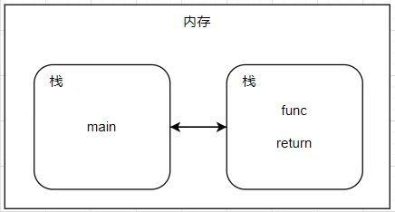

## 方法

> Golang的方法是作用在指定的数据类型上的(**和指定数据类型绑定**)，因此自定义类型都可以有方法。

**方法的申明和调用:**

- 方法必须和作用在指定的数据类型上
- 只能通过指定数据类型的变量来调用

~~~go
// Example
// 表示结构体A有一个test方法
type A struct{
    num int
}

// (a A)体现
func (a A) test(){
    a.num = 65535
    fmt.Println(a.num)
}

// 调用
var a A
a.test()
~~~

**方法的调用和传参机制：**

> 方法调用时会将调用的方法变量当做实参传递给方法。

