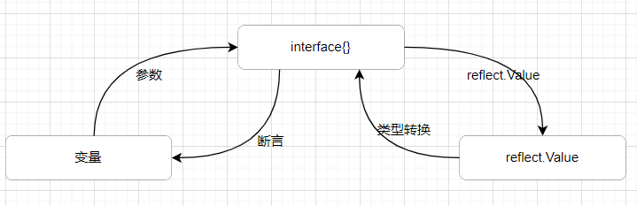

# 反射 Reflect

### 基本介绍

1. 反射可以在**运行时**动态的获取变量的各种信息，比如变量的类型，类别
2. 如果是struct变量，还可以获取到结构体本身的信息(field、method)
3. 通过反射可以修改变量的值，调用关联的方法
4. 使用反射需要使用 reflect 包
5. reflect.TypeOf(变量名)，获取变量的类型，返回reflect.Type类型
6. reflect.ValueOf(变量名)，获取变量的值，返回reflect.Value是一个struct。
7. 变量、interface{}和reflect.Value是可以相互转换的。

8. reflect.Value.Kind获取变量的类别，返回常量
9. Type是类型， Kind是类别，值可能系统，也可能不同
10. 使用反射的方式获取变量的值，要求数据类型匹配，就要使用方法